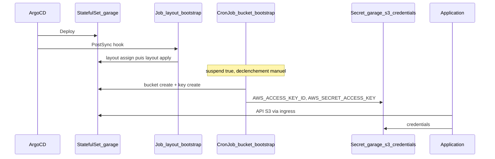

# Mock S3 avec Garage (CPIN)

## Notes sur ce repo

> Ce chart est fourni en l'état et sans support. Son but est présenter un service compatible S3 en remplacement de MinIO. Ce chart peut être utilisé par les projets sur l'environnement d'accélération. Il doit être adapté et approprié par les projets. Il est donné afin de faciliter l'intégration de cette solution dans un contexte CPiN mais ne se veut pas être un produit "production ready".

Ce dépôt déploie [Garage](https://garagehq.deuxfleurs.fr/) comme **mock S3** pour CPIN : une API compatible S3, sans AWS ni MinIO.

Le chart [`garage-cpin`](garage-cpin/Chart.yaml) enveloppe le sous-chart [`garage-origine`](garage-origine/) (clone du chart Helm [Deuxfleurs](https://git.deuxfleurs.fr/Deuxfleurs/garage), ClusterRoles non utilisés retirés).

Le profil CPIN est dans [`garage-cpin/values-garage.yaml`](garage-cpin/values-garage.yaml) :

- 1 réplica, `replicationFactor: 1`
- RBAC limité au namespace (`clusterScoped: false`)
- pas d’installation de CRD cluster (`kubernetesSkipCrd: true`)
- ingress S3 (A Modifier) : `s3customdomain.<suffix-environnement-cpin>`

## Architecture



## Specificité CPiN

Dans la documentation garage : [https://garagehq.deuxfleurs.fr/documentation/quick-start/#creating-a-cluster-layout](https://garagehq.deuxfleurs.fr/documentation/quick-start/#creating-a-cluster-layout), des commandes doivent être exécutées afin de créer un bucket et des AK/SK correspondantes. Ces opérations ne pouvant être réalisées dans un contexte CPiN, le chart garage-cpin permet de réaliser ces opérations via des job/cronjob.


### Hook layout (`layout-bootstrap`)

Fichiers : [`garage-cpin/templates/layout-bootstrap-job.yaml`](garage-cpin/templates/layout-bootstrap-job.yaml), [`garage-cpin/templates/layout-bootstrap-rbac.yaml`](garage-cpin/templates/layout-bootstrap-rbac.yaml).

Un Job ArgoCD **PostSync** (`argocd.argoproj.io/hook: PostSync`, recréé à chaque sync via `BeforeHookCreation`) initialise le cluster Garage :

1. Attend que les pods du StatefulSet soient Ready.
2. Exécute `garage status` sur le pod `*-0`.
3. Si des nœuds ont `NO ROLE ASSIGNED` : `layout assign` (zone `dc1`, capacité `1G`) puis `layout apply --version 1`.
4. Si le layout est déjà en place, le Job s’arrête sans rien modifier.

> Ce job s'exécute à chaque mise à jour du repo via Argo mais ne devrait appliquer l'initialisation de garage qu'une seule fois.

### CronJob bucket (`bucket-bootstrap`)

Fichiers : [`garage-cpin/templates/bucket-bootstrap-cronjob.yaml`](garage-cpin/templates/bucket-bootstrap-cronjob.yaml), [`garage-cpin/templates/bucket-bootstrap-rbac.yaml`](garage-cpin/templates/bucket-bootstrap-rbac.yaml).

Le CronJob sert de **modèle de Job** : `suspend: true` et un schedule factice (`0 0 1 1 *`). Il ne se lance jamais et il est nécessaire de le lancer depuis Argocd via Create Job.

Comportement :

1. Si le Secret `myapp-s3-credentials` existe déjà → rien à faire.
2. Sinon : création du bucket `default-bucket`, de la clé API `default-app-key`, grant read/write/owner, puis création du Secret (`AWS_ACCESS_KEY_ID`, `AWS_SECRET_ACCESS_KEY`, `BUCKET`, `AWS_DEFAULT_REGION=garage`).
3. Le secret de la clé n’est affiché qu’à la création. Si la clé Garage existe déjà sans Secret Kubernetes, le Job échoue volontairement.

Il est possible de modifier les valeurs puis de relancer le Job via Create Job pour créer un nouveau bucket et une nouvelle clé.

### Intégration de garage à CPiN.

1 - Ajouter ce repo comme repo d'infrastructure aux ressources de son projet.

2 - Modifier le fichier values, à minima pour changer le hostname

3 - Lancement du cronjob de création du bucket / AK-SK, depuis l'interface argocd lancer le cronjob "bucket-bootstrap" les logs doivent contenir  : 

```logs
==== BUCKET INFORMATION ====
Bucket:          e8018083cc0685ca019a06df78cfdd299184f76a431ab3991127667bd8f91b5d
Created:         2026-08-25 07:29:39.463 +00:00
Size:            0 B (0 B)
Objects:         0
Website access:  false
Global alias:    <BUCKET_NAME>
==== KEYS FOR THIS BUCKET ====
Permissions  Access key    Local aliases
[+] Creating API key XXXX...
2026-08-25T07:29:40.121835Z  INFO garage_net::netapp: Connected to 127.0.0.1:3901, negotiating handshake...
2026-08-25T07:29:40.162932Z  INFO garage_net::netapp: Connection established to 73cad0af4ffbba56
==== ACCESS KEY INFORMATION ====
Key ID:              <AK>
Key name:            default-app-key2
Secret key:          <SK>
Created:             2026-08-25 07:16:53.831 +00:00
Validity:            valid
Expiration:          never
```


### Consommation S3

Les applications lisent le Secret `myapp-s3-credentials` et appellent l’API S3 via l’ingress, région `garage`.

Ce secret n'est pas créé via argocd et ne peut donc pas être consulté via l'interface, il contient les clés suivantes :
```bash
AWS_ACCESS_KEY_ID=
AWS_DEFAULT_REGION=garage
AWS_SECRET_ACCESS_KEY=
BUCKET=
```

Le nom du secret créé correspond à la clé : ```bucketBootstrap.secretName```