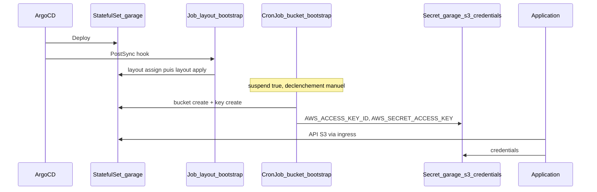

# Mock S3 avec Garage (CPIN)

Ce dépôt déploie [Garage](https://garagehq.deuxfleurs.fr/) comme **mock S3** pour CPIN : une API compatible S3, sans AWS ni MinIO.

Le chart [`garage-cpin`](garage-cpin/Chart.yaml) enveloppe le sous-chart [`garage-origine`](garage-origine/) (clone du chart Helm [Deuxfleurs](https://git.deuxfleurs.fr/Deuxfleurs/garage), ClusterRoles non utilisés retirés).

Le profil CPIN est dans [`garage-cpin/values-garage.yaml`](garage-cpin/values-garage.yaml) :

- 1 réplica, `replicationFactor: 1`
- RBAC limité au namespace (`clusterScoped: false`)
- pas d’installation de CRD cluster (`kubernetesSkipCrd: true`)
- ingress S3 (A Modifier) : `s3customdomain.app.cpin.numerique-interieur.fr`

## Architecture

## Hook layout (`layout-bootstrap`)

Fichiers : [`garage-cpin/templates/layout-bootstrap-job.yaml`](garage-cpin/templates/layout-bootstrap-job.yaml), [`garage-cpin/templates/layout-bootstrap-rbac.yaml`](garage-cpin/templates/layout-bootstrap-rbac.yaml).

Un Job ArgoCD **PostSync** (`argocd.argoproj.io/hook: PostSync`, recréé à chaque sync via `BeforeHookCreation`) initialise le cluster Garage :

1. Attend que les pods du StatefulSet soient Ready.
2. Exécute `garage status` sur le pod `*-0`.
3. Si des nœuds ont `NO ROLE ASSIGNED` : `layout assign` (zone `dc1`, capacité `1G`) puis `layout apply --version 1`.
4. Si le layout est déjà en place, le Job s’arrête sans rien modifier.

## CronJob bucket (`bucket-bootstrap`)

Fichiers : [`garage-cpin/templates/bucket-bootstrap-cronjob.yaml`](garage-cpin/templates/bucket-bootstrap-cronjob.yaml), [`garage-cpin/templates/bucket-bootstrap-rbac.yaml`](garage-cpin/templates/bucket-bootstrap-rbac.yaml).

Le CronJob sert de **modèle de Job** : `suspend: true` et un schedule factice (`0 0 1 1 *`). Il ne tourne pas tout seul. Il faut le lancer depuis Argocd via Create Job.

Comportement :

1. Si le Secret `myapp-s3-credentials` existe déjà → rien à faire.
2. Sinon : création du bucket `default-bucket`, de la clé API `default-app-key`, grant read/write/owner, puis création du Secret (`AWS_ACCESS_KEY_ID`, `AWS_SECRET_ACCESS_KEY`, `BUCKET`, `AWS_DEFAULT_REGION=garage`).
3. Le secret de la clé n’est affiché qu’à la création. Si la clé Garage existe déjà sans Secret Kubernetes, le Job échoue volontairement.

Il est possible de modifier les valeurs puis de relancer le Job via Create Job pour créer un nouveau bucket et une nouvelle clé.

## Consommation S3

Les applications lisent le Secret `myapp-s3-credentials` et appellent l’API S3 via l’ingress, région `garage`.
